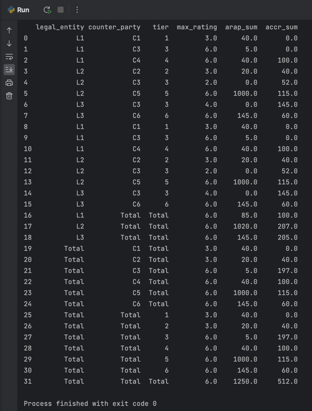
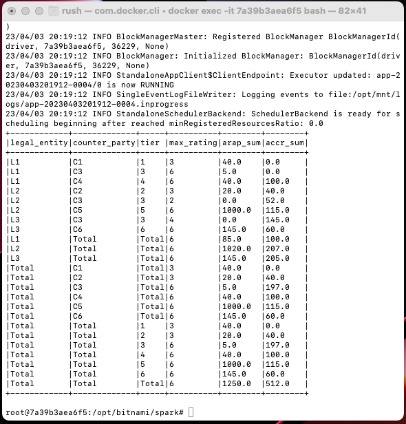

# Data ingestion exercise using two different frameworks Pandas & PySpark (Docker Setup for Local).

This guide will walk you through Data ingestion exercise using two different frameworks Pandas and Pyspark. We will also cover setting up a Spark cluster in Docker. 
In this process we will spin up 1 master, 1 worker, 1 sparkhistory severs in containers and runs as cluster locally

## Prerequisites

* Docker installed on your machine
* Basic understanding of Docker and Spark

## Local Setup & Execution 

1. Clone the repository containing the necessary Dockerfiles and configuration files.
2. Navigate to the directory where the files are stored in terminal. 

#### Using Pandas 

1. Run the follow command will execute solution for pandas. (use python3 if required)

   `python PD_Implementation.py`

#### using PySpark

1. Run the following command to build the Docker image and create the Docker container:

    `docker-compose up --build`

    This will build the image and start the Spark cluster.

2. Once the cluster is up and running, you can access the Spark Web UI by visiting http://localhost:8080 and history server using http://localhost:18080 in your web browser.

3. login in to master using below command. . Replace "container id" with the name of your Docker container id.

    `docker exec -it <container id> bash`

4. You can submit a PySpark job to the cluster by running the following command. Replace "container id" with the name of your Docker image id.

    `spark-submit --master spark://<container id>:7077 --executor-memory 1g /opt/mnt/src/Legal_ent_example.py `

## Pandas Sample Output

## Spark sample Output

